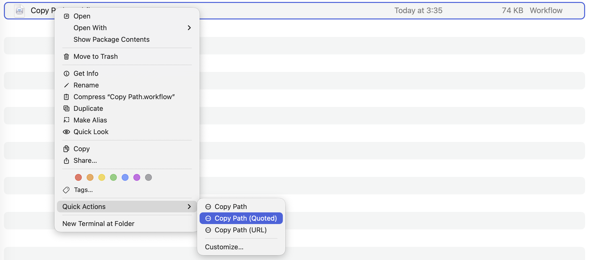

<p align="center">
  <a href="https://GitHub.Com/NikolaRHristov/QuickActions">
    
  </a>
  <a href="https://GitHub.Com/NikolaRHristov/QuickActions">
    
  </a>
  <a href="LICENSE">
    
  </a>
</p>

# [Quick Actions] 📋

A small set of macOS **Automator Quick Actions** (Finder Services) that copy the
path of the selected file or folder to the clipboard.

Nothing personal is baked in - the actions operate only on whatever Finder hands
them (`$@` / stdin paths), so they work for anyone on any Mac.

<p align="center">
  
</p>

> [!NOTE]
>
> The actions copy the _path_ - not the file contents. Great for pasting into a
> terminal, a chat, or a document without dragging a file around.

## Included Actions 🧩

| Action                 | What it copies                 | Example output                                  |
| ---------------------- | ------------------------------ | ----------------------------------------------- |
| **Copy Path**          | Raw absolute path              | `/Users/you/Projects/foo/bar.txt`               |
| **Copy Path (Quoted)** | `printf %q`-quoted, shell-safe | `/Users/you/Projects/foo/bar\ with\ spaces.txt` |
| **Copy Path (URL)**    | `file://` URL, percent-encoded | `file:///Users/you/Projects/foo/bar.txt`        |

All three handle **multiple** selected items, joined by newlines.

## Installation 🚀

> [!WARNING]
>
> **Don't double-click the `.workflow` files to install them.** Double-clicking
> installs the action, but it _moves_ the file out of this folder into
> `~/Library/Services/`, so the copy in your project disappears - and if you
> later `git pull` and reinstall, you have no local source to copy from. Always
> install with `cp -R` as shown below, which leaves the originals untouched.

**`Terminal`**

```sh
git clone https://github.com/NikolaRHristov/QuickActions.git
cd QuickActions

cp -R "Copy Path.workflow" \
	"Copy Path (Quoted).workflow" \
	"Copy Path (URL).workflow" \
	~/Library/Services/
```

Then force macOS to re-register the new Services and restart Finder:

**`Terminal`**

```sh
/System/Library/CoreServices/pbs -update && killall Finder
```

After Finder relaunches the three actions will appear in the right-click menu
under **Quick Actions** (macOS Ventura+) or **Services** (older macOS).

### Updating / re-installing 🔄

If you need to reinstall (e.g. after a `git pull`), remove the old copies first
so macOS doesn't cache the stale versions:

**`Terminal`**

```sh
rm -rf ~/Library/Services/"Copy Path.workflow" \
	~/Library/Services/"Copy Path (Quoted).workflow" \
	~/Library/Services/"Copy Path (URL).workflow"

cp -R "Copy Path.workflow" \
	"Copy Path (Quoted).workflow" \
	"Copy Path (URL).workflow" \
	~/Library/Services/

/System/Library/CoreServices/pbs -update && killall Finder
```

## Usage 🖱️

1. In **Finder**, select one or more files or folders.
2. **Right-click → Quick Actions** (macOS Ventura and later) or **Right-click →
   Services** (older macOS) → pick **Copy Path**, **Copy Path (Quoted)**, or
   **Copy Path (URL)**.
3. The result is now on your clipboard - paste it anywhere with `Cmd+V`.

### Keyboard shortcut (optional) ⌨️

**System Settings → Keyboard → Keyboard Shortcuts… → Services → Files and
Folders** and assign a shortcut to each action (e.g. `Cmd+Shift+C`).

## Troubleshooting 🛠️

If the actions don't appear in the context menu after installing:

1. Make sure the workflows are in **`~/Library/Services/`** - not
   `~/Library/Automator/` or anywhere else.
2. Run the `pbs -update && killall Finder` command above again.
3. Go to **System Settings → Keyboard → Keyboard Shortcuts → Services → Files
   and Folders** and make sure all three checkboxes are **ticked**.
4. If they still don't appear, log out and back in - a full session restart
   flushes the Services cache more thoroughly than `killall Finder`.

## Requirements 💻

- macOS with Automator (all modern releases).
- The embedded scripts run under `/bin/zsh`.

## Contributing 🤝

Contributions are welcome! This project follows the [Contributor
Covenant][contributor-covenant] Code of Conduct - see
[`CONTRIBUTING.md`](CONTRIBUTING.md) for the full pledge, standards, and
enforcement guidelines.

## License 📜

Released under the **CC0 1.0 Universal** public domain dedication. See the
[`LICENSE`](LICENSE) file for the full text - you may use, modify, and
redistribute these workflows freely, including for commercial purposes, with no
attribution required.

[Quick Actions]: HTTPS://GitHub.Com/NikolaRHristov/QuickActions
[contributor-covenant]: HTTPS://www.contributor-covenant.org
